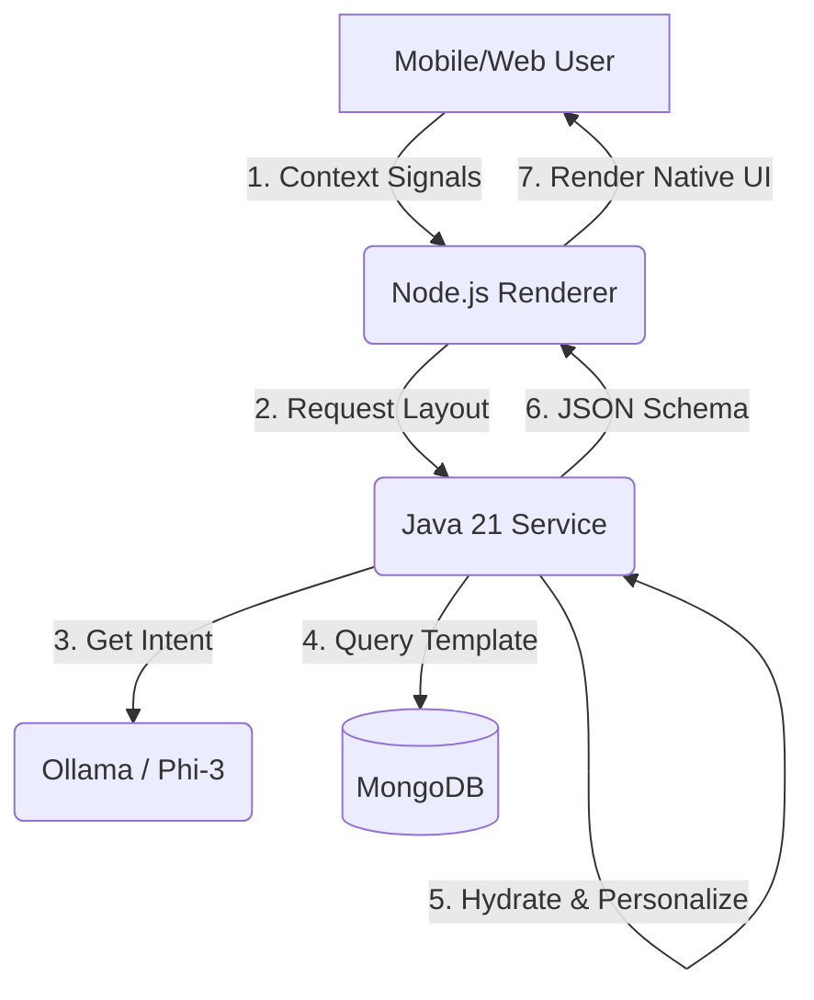

# 📱 Adaptive UI Superapp

A **Hyper-Personalized, Server-Driven UI (SDUI)** architecture powered by **Java 21**, **MongoDB**, and **Local AI**.

This project demonstrates a next-generation **"Superapp"** architecture where the user interface is not hardcoded on the client. Instead, it is dynamically generated and "morphed" by a Java 21 backend based on real-time user context (location, time, habits) and refined by a Small Language Model (Phi-3) running locally.

---

## 🏗️ Architecture

The system is built on a decoupled, containerized microservices architecture:

| Service     | Technology                         | Role |
|------------|------------------------------------|------|
| Frontend   | Node.js (Express + EJS)            | A lightweight "dumb" renderer. It captures user signals (GPS, Time) and renders whatever JSON layout the backend sends. |
| Backend    | Java 21 (Spring Boot)              | The high-performance brain. Uses Virtual Threads (Project Loom) to handle massive concurrency while orchestrating data from DB and AI. |
| Database   | MongoDB 7.0                        | Stores flexible UI component schemas ("Lego blocks") and user behavior vectors. |
| AI Engine  | Ollama (Phi-3)                     | A local Small Language Model (SLM) that rewrites UI copy in real-time to match the user's specific intent. |

---

## 🧩 System Diagram


## 🛠️ Prerequisites

Docker Desktop (running)

Git

⚡ Quick Start

### 1️⃣ Clone & Setup

mkdir superapp-demo
cd superapp-demo
# (Copy the application files into this directory)


### 2️⃣ Launch the Stack

docker-compose up --build


Note: On the first run, the ollama-puller service will take 1–2 minutes to download the Phi-3 AI model (~2GB). Watch the logs for "Waiting for Ollama...".

### 3️⃣ Test the Personalization

Open your browser to: http://localhost:3000

Scenario A (Default)

Context: "I am rushing to a meeting"

Result: AI suggests "Quick Coffee Grab" (Orange Button).

Scenario B (Evening/Relaxed)

URL: http://localhost:3000/?context=It is a cozy rainy evening at home

Result: AI suggests "Comfort Food Delivery" (Purple Button).

## 🚀 Message Flow Architecture

This document outlines the step-by-step process of capturing user context and delivering a dynamic, AI-driven UI response.

### 1. Signal Capture

The process begins when the user opens the application. The Frontend captures environmental and behavioral context.

Example Context: "User is at the gym, 7:00 PM"

### 2. Intent Classification

The Frontend transmits this context to the Backend. The Java service then queries the AI Model to interpret the data:

Query: "What does a user at the gym want?"

AI Inference: RECOVERY_FOOD

### 3. Template Retrieval

Once the intent is identified, the Backend queries MongoDB for specific UI components or layout templates tagged with the #RECOVERY_FOOD metadata.

### 4. Dynamic Copywriting

To maximize engagement, the Backend requests personalized content from the AI:

Query: "Write a button label for a protein shake promo for a tired gym user."

AI Generation: "Refuel with 20% Off"

### 5. Response Packaging

The Backend bundles the retrieved templates and the generated copy into a single JSON SDUI (Server-Driven UI) payload.

### 6. Rendering

Finally, the Frontend receives the payload, maps the JSON definitions to native widgets (such as Buttons and Cards), and renders the personalized interface for the user.

## 📂 Project Structure
```text
superapp-demo/
├── docker-compose.yml       # Orchestrates Java, Node, Mongo, Ollama
├── mongo-seed/
│   └── seed.js              # Pre-populates UI templates in MongoDB
├── backend/                 # Java 21 Spring Boot Application
│   ├── Dockerfile           # Multi-stage build (Maven -> JRE)
│   ├── pom.xml              # Dependencies (LangChain4j, Spring Data)
│   └── src/                 # Business Logic & AI Integration
└── frontend/                # Node.js Application
    ├── Dockerfile           # Alpine Node image
    ├── package.json         # Node dependencies
    ├── server.js            # Express Server
    └── views/               # EJS Templates (The "Phone Frame" UI)
```
## 🔧 Technology Highlights
### 🧵 Java 21 & Virtual Threads

Enable Virtual Threads in application.properties:
```
spring.threads.virtual.enabled=true
```
This allows the backend to handle thousands of concurrent AI/DB requests without blocking OS threads, making it ideal for high-scale Superapps.

### 🧩 Server-Driven UI (SDUI)

The Frontend contains zero business logic. It doesn't know what a "Coffee Button" is until the backend sends the instruction:
```
{
  "type": "HeroButton",
  "props": {
    "label": "Morning Brew",
    "color": "#FF8C00",
    "action": "..."
  }
}
```
This allows you to change the entire app interface instantly without an App Store update.

## 🛑 Troubleshooting
| Issue |	Solution
-- | --
"Backend failed to connect to MongoDB" |	Ensure docker-compose is running. If restarting, use docker-compose down -v to reset volumes.
"Error: Brain Offline" in UI |	The Java backend is likely still starting up or downloading the AI model. Wait 60 seconds and refresh.
Docker Permission Error (Mac) |	Enable File Sharing for your project folder in Docker Desktop → Settings → Resources.

## 📜 License
This project is open-source and available under the MIT License.